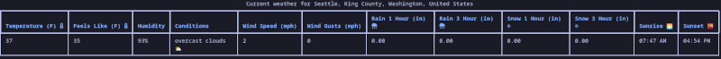
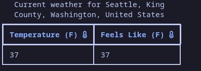
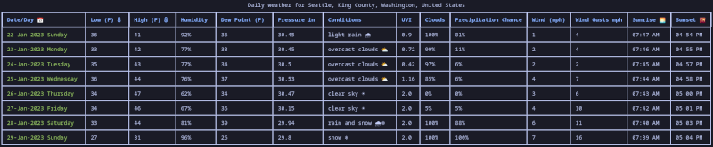
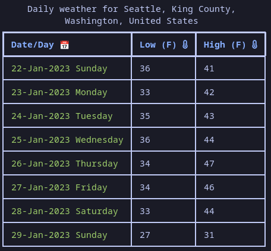
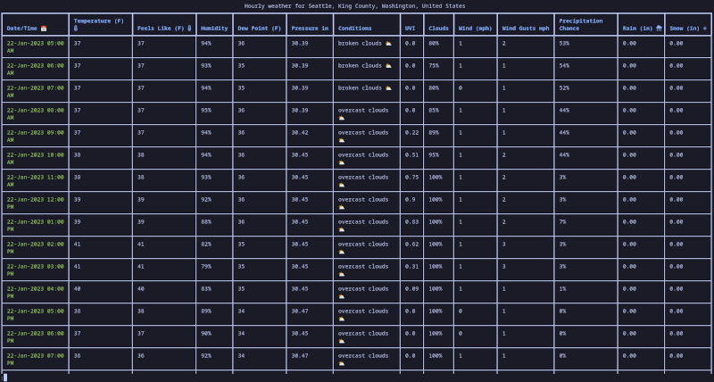
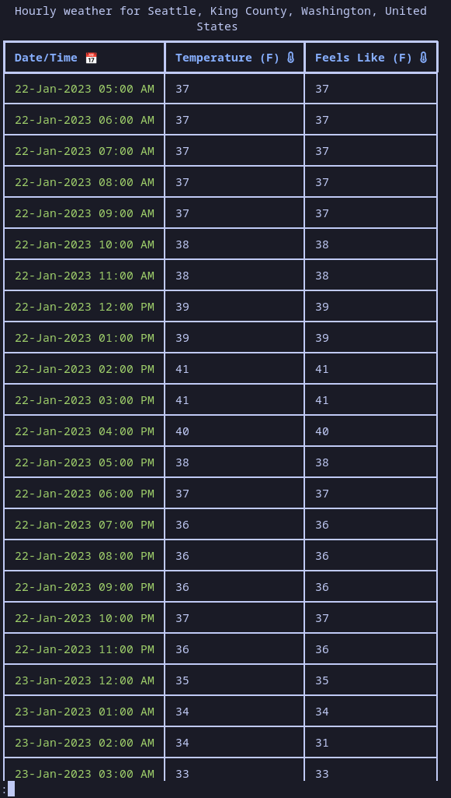

# Weather Command

[](https://github.com/sanders41/weather-command/actions?query=workflow%3ATesting+branch%3Amain+event%3Apush)
[](https://results.pre-commit.ci/latest/github/sanders41/weather-command/main)
[](https://codecov.io/gh/sanders41/weather-command)
[](https://badge.fury.io/py/weather-command)
[](https://github.com/sanders41/weather-command)

A command line weather app

## Installation

Installation with [pipx](https://github.com/pypa/pipx) is recommended.

```sh
pipx install weather-command
```

Alternatively Weather Command can be installed with pip.

```sh
pip install weather-command
```

## Usage

First an API key is needed from [OpenWeather](https://openweathermap.org/), A free account is all that
is needed. Once you have your API key create an environment variable named `OPEN_WEATHER_API_KEY` that
constains your API key.

```sh
export OPEN_WEATHER_API_KEY=your-api-key
```

Each time the shell is restarted this variable will be cleared. To avoid this it can be added to your
profile. For example if your shell is zsh the API key can be added to the `~/.zshenv` file. Doing this
will prevent the need to re-add the key each time the shell is started.

To get the weather for a city:

```sh
weather city seattle
```

Once installed you can also add aliases to your shell to make it quick to get a forecast. For example
if your shell is zsh you can add something like the following to your `~/.zshrc` file:

```sh
alias we="weather zip 98109 -i --am-pm"
alias wed="weather zip 98109 -i --am-pm -f daily"
alias weh="weather zip 98109 -i --am-pm -f hourly"
```

After adding this to the `~/.zshrc` you will need to restart your terminal. After that typing `we`
will get the current forecast, `wed` will get the daily forecast and `weh` will get the hourly forecast.

## Examples

- Current Weather



- Current Weather Temp Only



- Daily Weather



- Daily Weather Temp Only



- Hourly Weather



- Hourly Weather Temp Only



## Settings
weather now has the ability to save settings to default certain flags. The list of possible settings can be seen with:

```sh
weather settings --help
```
## Contributing

Contributions to this project are welcome. If you are interesting in contributing please see our [contributing guide](CONTRIBUTING.md)
